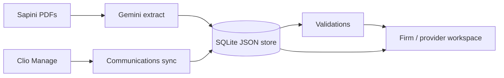

# Caseboard

Workspace for the Sapini matter. Firm users read a timeline, compare facts that disagree, and work validation findings. A provider view shows only that provider's own records.

PDFs are extracted in one Gemini call per file. Phone calls, emails, and notes come from Clio. Both land in a SQLite document store, and Python validations run against that store.



## Run it

Requires Python 3.12.

```bash
cd caseboard
cp .env.example .env
task install
task up
```

The board is at http://127.0.0.1:8765/. `task test` runs the validation tests.

If `task` is not installed, the same commands are:

```bash
python3 -m venv .venv
.venv/bin/pip install -e ".[dev]"
.venv/bin/uvicorn caseboard.main:app --host 127.0.0.1 --port 8765
```

## Configuration

Copy `caseboard/.env.example` to `caseboard/.env`. None of those values are committed.

| Variable | What it does |
|---|---|
| `GEMINI_API_KEY` | Enables **Extract PDFs**. The model is `gemini-3.8-flash`. |
| `CLIO_CLIENT_ID` / `CLIO_CLIENT_SECRET` | Clio Manage app key and secret. |
| `CLIO_REDIRECT_URI` | Must match the redirect registered on the Clio app, including port and path. The app accepts `/callback` and `/clio/callback`. |
| `CLIO_REGION_HOST` | `https://app.clio.com` for the US firm. |
| `CLIO_MATTER_ID` | Matter to sync. If empty, the sync looks for the one Justin Sapini matter. |
| `CORPUS_DIR` | Folder of PDFs. Leave it blank to use `../Sapini documents`. |

The Clio app needs read access for Matters, Communications, and Notes. Permissions are fixed when someone approves the app, so turn them on and click **Save** before connecting. If a token still cannot read data, remove the app under Clio's My integrations and connect again.

The process has to listen on the same host and port as `CLIO_REDIRECT_URI`. `task up` uses port 8765.

## What the board does

**Firm** is the default. Timeline, Evidence, and To-do are the three tabs. The page on the right is the cited PDF.

- **Extract PDFs** sends each corpus PDF to Gemini and stores segments, facets, and timeline events. A long scan is compressed first. Page count stays the same.
- **Sync Clio** pulls phone calls, emails, notes, and conversation messages for the matter. Every Clio row is firm-only.
- **Run validations** rebuilds the to-do list from the store. Checking an item off keeps that finding resolved if the same check comes back.

**Provider** drops the firm tabs, the action buttons, and anything marked firm-only. Pick Montefiore Nyack, Advanced Rockland Chiropractic, SportsCare, or New Horizon. That view only includes clinical records that belong to the selected provider.

## Layout

```
caseboard/
├── caseboard/          # FastAPI app, HTMX templates, extract / Clio / validations
├── tests/
├── design_handoff_case_workspace/   # visual spec for the workspace
├── .env.example
└── Taskfile.yml
```

The sample PDFs stay outside git, in `Sapini documents/` next to `caseboard/`.

## Deploy

Pushes to `main` on [AppliedAIHack](https://github.com/2339140098NC/AppliedAIHack) deploy through Vercel. The repo root `app.py` is the FastAPI entry. Vercel installs `requirements.txt`.

On Vercel the filesystem is read-only except `/tmp`, so the SQLite file and the Clio token live in `/tmp/caseboard`. A new instance starts empty and does not keep the local database. Set these in the Vercel project (Project → Settings → Environment Variables), using the same values as `caseboard/.env`:

| Variable | Production value |
|---|---|
| `GEMINI_API_KEY` | Same key as local. |
| `CLIO_CLIENT_ID` / `CLIO_CLIENT_SECRET` | Same app key and secret. |
| `CLIO_REDIRECT_URI` | `https://<your-project>.vercel.app/callback` |
| `CLIO_REGION_HOST` | `https://app.clio.com` |
| `CLIO_MATTER_ID` | `1811189963` |

Register that callback URL on the Clio app as well. If `CLIO_REDIRECT_URI` is left blank, the app uses `https://$VERCEL_PROJECT_PRODUCTION_URL/callback`.

The sample PDFs are not in git, so **Extract PDFs** finds an empty corpus until `CORPUS_DIR` points at files that exist on the deployment. Gemini and Clio work that run longer than the function limit (60 seconds) can be cut off when the request ends.
